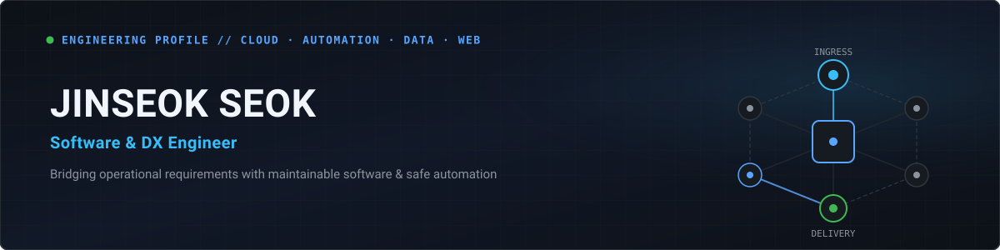
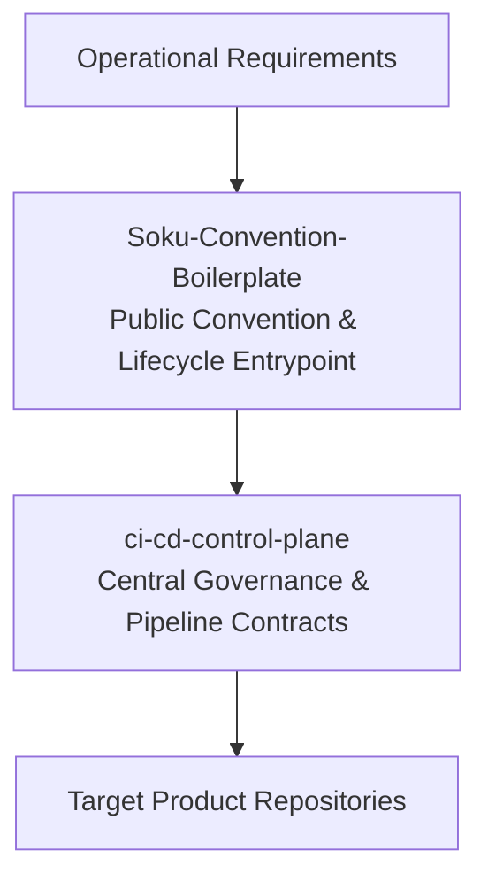

<!-- markdownlint-disable MD013 MD033 MD041 -->

  

  

  <h1>JINSEOK SEOK</h1>

  
<strong>Software &amp; DX Engineer</strong> Cloud · Automation · Data · Web

  

    I turn operational needs into maintainable software, 
    developer workflows, and safe automation.
  

  

    🇰🇷 <b>Korean</b> — Native &nbsp;•&nbsp; 🇯🇵 <b>Japanese</b> — Daily Work &nbsp;•&nbsp; 🌐 <b>English</b> — Technical Documentation
  

  

    <a href="#-featured-engineering-work"><b>Featured Work</b></a> &nbsp;•&nbsp;
    <a href="#-engineering-experience"><b>Experience</b></a> &nbsp;•&nbsp;
    <a href="https://github.com/Soku-JINSEOK?tab=repositories"><b>Repositories</b></a> &nbsp;•&nbsp;
    <a href="https://github.com/Soku-JINSEOK"><b>GitHub</b></a>
  

<!-- markdownlint-enable MD013 MD033 MD041 -->

---

## 👨‍💻 About

I am a software and DX engineer based in Japan. My engineering work bridges business operations and engineering: translating operational requirements into maintainable software, cloud systems, and developer automation that remain robust long after initial release.

<!-- markdownlint-disable MD033 -->

<b>🇰🇷 한국어 / 🇯🇵 日本語 요약 (Click to expand)</b>

 

> **🇰🇷 한국어**: 한국 출신으로 일본에서 근무하는 소프트웨어 및 DX 엔지니어입니다. 비즈니스 요구사항을 유지보수 가능한 소프트웨어, 클라우드 시스템, 개발 자동화로 구현하며 맥락과 근거가 남는 엔지니어링 소통을 지향합니다.
>
> **🇯🇵 日本語**: 日本を拠点に活動するソフトウェアおよびDXエンジニアです。業務要件を保守性の高いソフトウェア、クラウドシステム、開発自動化へと落とし込み、持続可能な開発ワークフローを構築します。

<!-- markdownlint-enable MD033 -->

---

## 🚀 Featured Engineering Work

### 🧩 [Flagship] Soku Ecosystem
> **Repository Lifecycle & CI/CD Governance Framework**

An engineering initiative designed to make repository conventions, lifecycle management, and CI/CD governance explicit, reviewable, and automated.

* **[Soku-Convention-Boilerplate](https://github.com/Soku-JINSEOK/Soku-Convention-Boilerplate)** `[Public]`
  * **Role & Architecture:** Public convention entry point owning the lifecycle, manifest schema, managed-file ownership model, and generic provider boundary.
  * **Tech Stack:** `TypeScript` `GitHub Actions` `Shell`
* **`ci-cd-control-plane`** `[Private · Selected details]`
  * **Role & Architecture:** Central governance repository defining versioned pipeline contracts and declarative CI/CD provider boundaries.
  * **Tech Stack:** `Go` `Cloud Architecture` `Declarative Pipelines`

---

### 🛠️ Selected Projects

### 🎬 CutVi `[Private · Selected details]`
> **Desktop Media Packaging & Processing Tool**
>
> * **Objective:** Privacy-first, local-first media packaging without cloud uploads.
> * **Engineering Highlights:** Secure local processing via Electron desktop wrapper with native FFmpeg streaming pipelines.
> * **Tech Stack:** `TypeScript` `React` `Electron` `FFmpeg`

### 🏗️ Archviz `[Private · Selected details]`
> **Declarative Architecture Modeling & Load System**
>
> * **Objective:** Declarative architecture visualization and simulated load-scenario verification.
> * **Engineering Highlights:** Parses declarative YAML system models into visual topologies with simulated throughput verification.
> * **Tech Stack:** `Go` `React` `YAML`

### 📚 report-hub `[Private · Selected details]`
> **Automated Business Intelligence & Reporting Pipeline**
>
> * **Objective:** Automated operational data aggregation and multi-source reporting.
> * **Engineering Highlights:** High-reliability batch data transformation, sheet synchronization, and reporting automation for business operations.
> * **Tech Stack:** `JavaScript` `Google Apps Script` `Google Sheets`

### 🌏 SOKU-PR-site `[Private · Selected details]`
> **Multilingual Cloud Portfolio Platform Prototype**
>
> * **Objective:** Type-safe multilingual portfolio platform with decoupled cloud backend.
> * **Engineering Highlights:** Type-safe multilingual rendering, executable validation, and serverless integration.
> * **Tech Stack:** `Angular` `Go` `GCP`

---

## 💻 Engineering Experience

<!-- markdownlint-disable MD013 MD033 -->

  
  
  
  

<!-- markdownlint-enable MD013 MD033 -->

* **Practical & Professional Experience:** Business workflow automation, cloud systems (Google Cloud, Google Workspace / Apps Script), operational software.
* **Project Engineering:** Web and desktop applications (React, Angular, Electron), declarative data modeling, media processing pipelines.
* **Current Engineering Focus:** Repository conventions, CI/CD governance, lifecycle tooling (Soku ecosystem).
* **Languages used across work and projects:** TypeScript, Go, Python, JavaScript.

---

## 🧭 How I Work

Engineering quality is defined by predictable delivery, testable code, and transparent collaboration:

* **Issue-first:** Every task begins with clear intent, scope definition, and explicit acceptance criteria before implementation.
* **Contract-first:** Interfaces, API schemas, and data structures are formally defined to ensure decoupled, testable components.
* **Verification-centered:** Code changes are backed by automated tests, type validation, and concrete execution evidence.
* **Explicit approval:** Production releases, schema migrations, and security-sensitive configurations require deliberate human sign-off.

> **AI-Assisted Development:** AI-assisted workflows adhere to the same review, linting, and testing standards as human-authored code.

---

## 📍 Explore My Work

* **Live Status & Roadmap:** [Repository Operations · GitHub Project #2](https://github.com/users/Soku-JINSEOK/projects/2) is the source of truth for current status and priorities.
* **Location:** Japan 🇯🇵

---

<!-- markdownlint-disable MD033 -->

  Readable conventions · Safe automation · Verifiable delivery

<!-- markdownlint-enable MD033 -->
